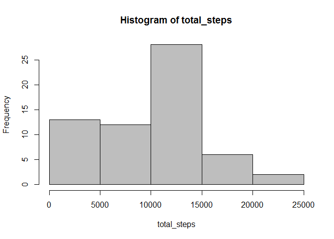
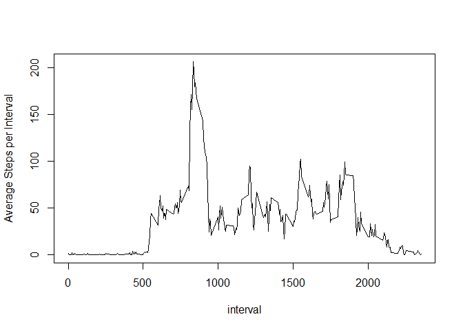
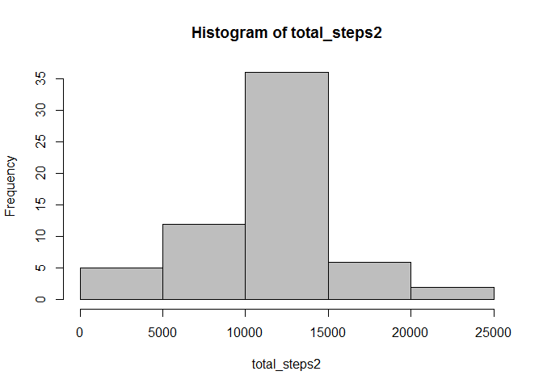
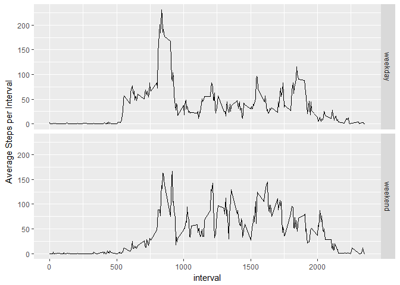

# Reproducible Research: Peer Assessment 1


The following documents the steps taken to complete Course Project 1 of Reproducible Research. The data for this project is a set of information on steps recorded by an individual using an activity monitoring device.

### Loading and preprocessing the data


```r
data <- read.csv(unz("activity.zip", "activity.csv"))
data$date <- as.Date(data$date)

str(data)
```

```
## 'data.frame':	17568 obs. of  3 variables:
##  $ steps   : int  NA NA NA NA NA NA NA NA NA NA ...
##  $ date    : Date, format: "2012-10-01" "2012-10-01" ...
##  $ interval: int  0 5 10 15 20 25 30 35 40 45 ...
```

The data looks ready to go!

### What is the mean total number of steps taken per day?

1. Calculate the total steps per day

```r
total_steps <- tapply(data$steps, data$date, sum, na.rm=TRUE)
```

2. Create a Histogram

```r
hist(total_steps, col="grey")
```

<!-- -->

3. Calculate the mean and median steps

```r
mean(total_steps)
```

```
## [1] 9354.23
```

```r
median(total_steps)
```

```
## [1] 10395
```

### What is the average daily activity pattern?

1. Make a time series plot of the 5-minute interval and average number of steps taken, averaged across all days


```r
library(dplyr)
```


```r
byinterval <-
    data %>%
    group_by(interval) %>%
    summarize(avg=mean(steps, na.rm=TRUE))

with(byinterval, plot(interval, avg, type='l', ylab="Average Steps per Interval"))
```

<!-- -->

2. Which 5-minute interval, on average across all the days in the dataset, contains the maximum number of steps?


```r
byinterval[byinterval$avg==max(byinterval$avg),]
```

```
## # A tibble: 1 × 2
##   interval      avg
##      <int>    <dbl>
## 1      835 206.1698
```
### Imputing missing values
1. Calculate and report the total number of missing values in the dataset


```r
sum(is.na(data$steps))
```

```
## [1] 2304
```

2. Devise a strategy for filling in all the missing values in the dataset: *Fill in missing values with the average number of steps by interval*

3. Create a new dataset that is equal to the original dataset but with the missing data filled in

```r
data2<-
data %>%
    group_by(interval)%>%
    mutate(steps_new=ifelse(is.na(steps)==TRUE, mean(steps, na.rm=TRUE), steps))

head(data2)
```

```
## Source: local data frame [6 x 4]
## Groups: interval [6]
## 
##   steps       date interval steps_new
##   <int>     <date>    <int>     <dbl>
## 1    NA 2012-10-01        0 1.7169811
## 2    NA 2012-10-01        5 0.3396226
## 3    NA 2012-10-01       10 0.1320755
## 4    NA 2012-10-01       15 0.1509434
## 5    NA 2012-10-01       20 0.0754717
## 6    NA 2012-10-01       25 2.0943396
```
4. Make a histogram of the total number of steps taken each day and calculate the mean and median total number of steps taken per day.


```r
total_steps2 <- tapply(data2$steps_new, data2$date, sum, na.rm=TRUE)

hist(total_steps2, col="grey")
```

<!-- -->

```r
mean(total_steps2)
```

```
## [1] 10766.19
```

```r
median(total_steps2)
```

```
## [1] 10766.19
```

Previously, the average total steps per day were skewed downward, with the mean being less than the median. Imputing missing data shifted the distribution of total steps such that the mean is equal to the median.

### Are there differences in activity patterns between weekdays and weekends?

1. Create a new factor variable in the dataset with two levels - "weekday" and "weekend" indicating whether a given date is a weekday or weekend day


```r
data2<-
mutate(data2, weekpart=ifelse(weekdays(date) %in% c("Saturday", "Sunday"), "weekend", "weekday"))

byinterval2 <-
    data2 %>%
    group_by(interval, weekpart) %>%
    summarize(avg=mean(steps_new, na.rm=TRUE))
```

2. Make a panel plot containing a time series plot of the 5-minute interval and the average number of steps taken, averaged across all weeday days or weekend days.


```r
library(ggplot2)

qplot(interval, avg, facets=weekpart~., data=byinterval2
      , geom="line"
      , ylab="Average Steps per Interval")
```

<!-- -->

